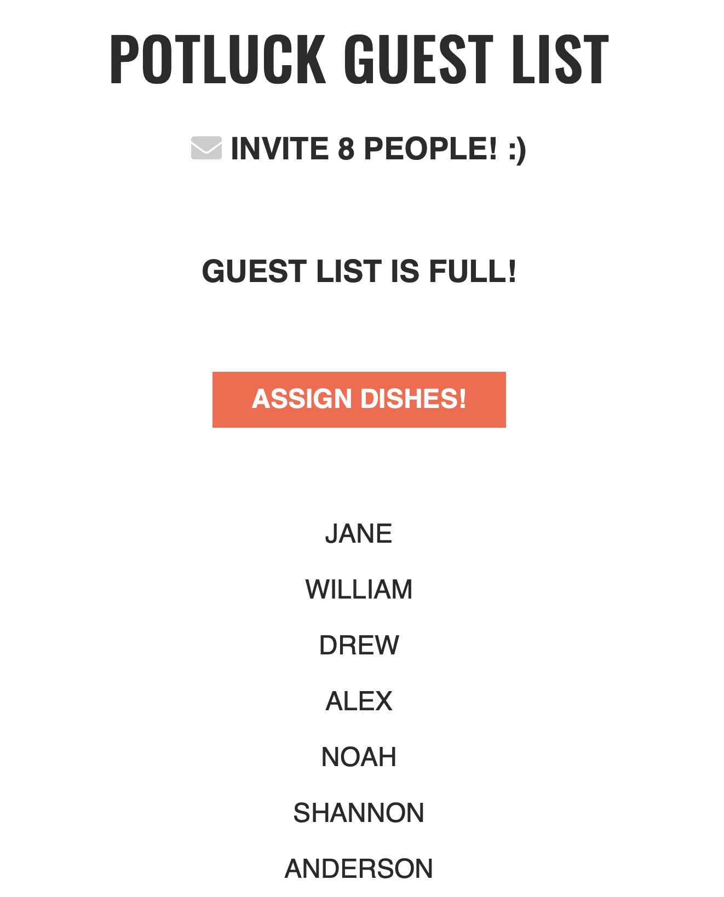

<h1>Potluck Guest List</h1>

<h2>Objective:</h2>

JavaScript is used to assemble an exclusive guest list and loop through an array to distribute items to individual guests without duplication.

<h4>JavaScript Toolbox:</h4>

* Function Expressions
* Disabled Property
* Event Handlers
* Boolean Values
* Event Listeners
* querySelectorAll()
* Looping through arrays  

